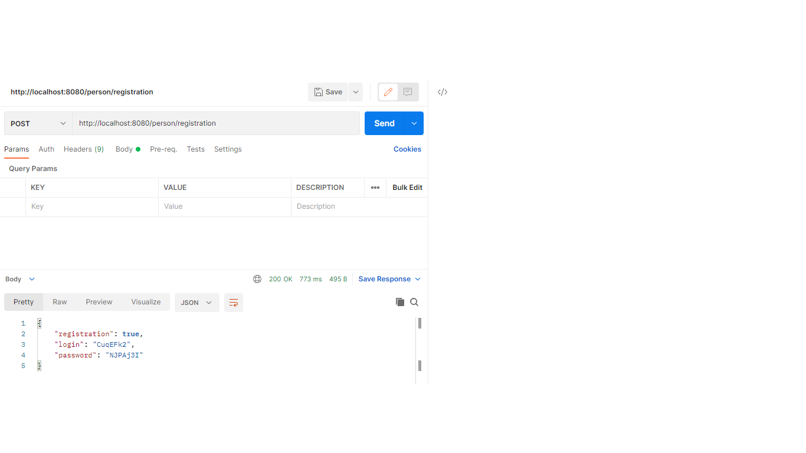
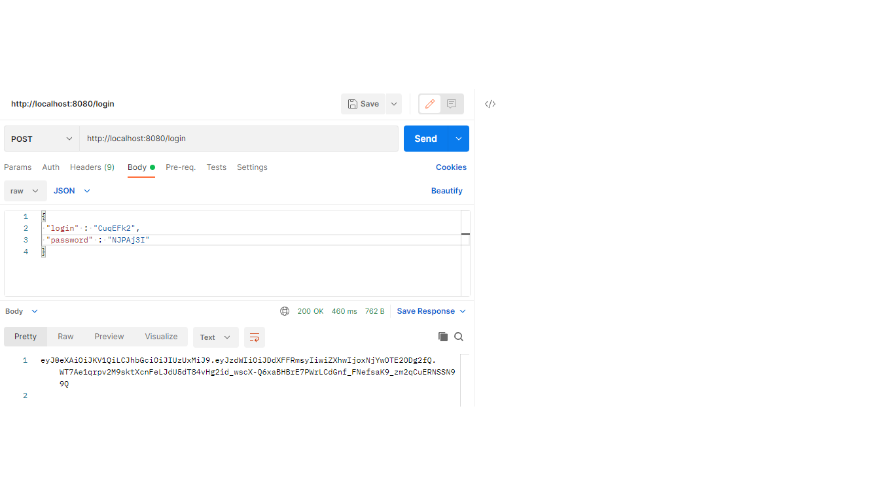
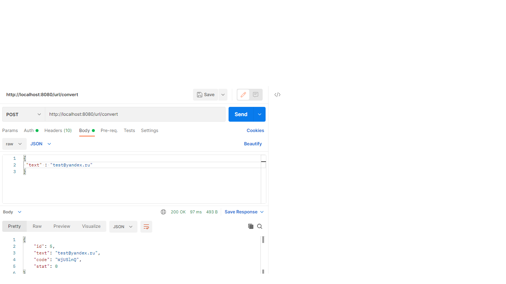
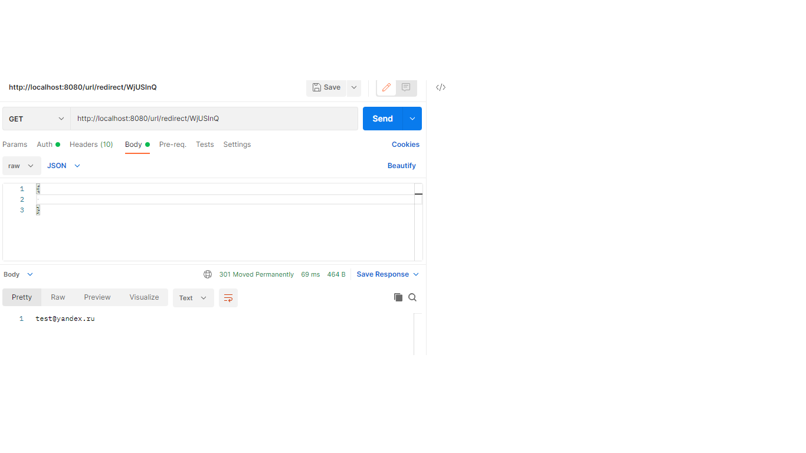
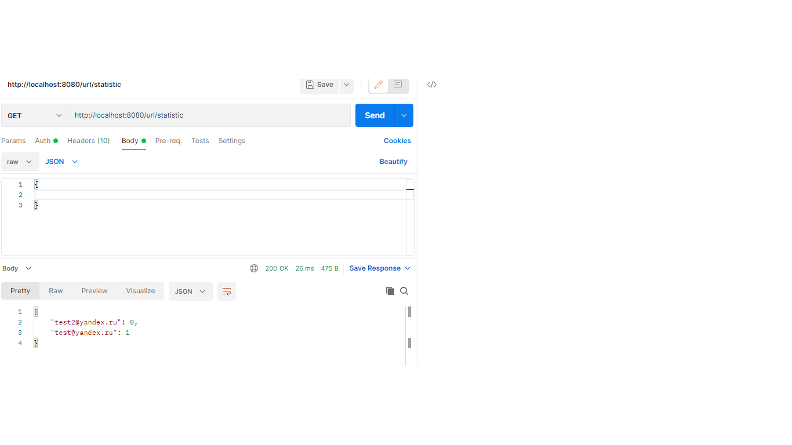

# job4j_urlshortcut

Сервис замены ссылок 

Описание: Сервис заменяет пользовательские ссылки на уникальные ассоциированные ключи и обеспечивает удобный и быстрый доступ к ним. 
Сначала пользователь регистрирует сайт и получает логин и пароль, затем отправляет ссылки для конвертации. Количество переходов по каждому
ключу подсчитывается и отображается в виде статистики.

Регистрация. Чтобы зарегистрировать сайт в систему нужно отправить запрос:

Авторизация. Для получения token'а пользователь вводит полученный логин/пароль:

Регистрация URL и конвертация. Поле того, как пользователь зарегистрировал свой сайт, он может отправлять в систему ссылки и получать ассоциированный ключ:

Переадресация. При отправке запроса с заданным ключом, система возвращает ассоциированную ссылку:

Статистика. Система подсчитывает количество переходов по каждому ключу
